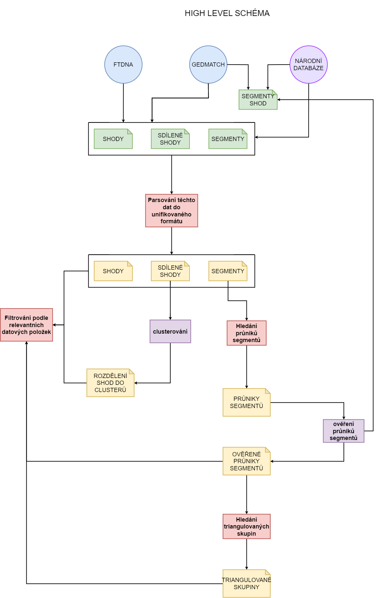

# genetic-genealogy

## Diagramy

### Workflow diagram
Za následujícím odkazem najdete diagram 
popisující workflow, které je možné spustit s 
aktuálním stavem zdejších souborů:

https://drive.google.com/file/d/19UCeR0YhxLGEBcRki8iF9l6CkqsWxC0R/view?usp=share_link 

### Diagram popisující funkcionalitu aplikace
Zde najdete diagram, ve kterém jsou zachyceny současné i budoucí funkce 
této aplikace. 

Nahoře je _high level schéma_ naznačující , které funkce bude aplikace podporovat, pod ním
je _low level schéma_, které popisuje dané funkce podrobněji, zmiňuje se i o konkrétní implementaci 
a jak spolu budou dané nástroje komunikovat.

https://drive.google.com/file/d/1zltsMH-SDBmn84_Kg38oEF7a6StJ5UmY/view?usp=sharing

### _High level schéma_
 

## Formáty souborů
Formáty jednotlivých druhů vstupních i výstupních souborů jsou specifikovány
pomocí tříd obsažených v souboru *headers.py*.
Výstupní soubory jsou popsány jako enum možných sloupců.

Každá z těchto tříd definuje, jak bude vypadat hlavička příslušného druhu souboru.
Je-li to potřeba, třída definuje mapování mezi sloupci vstupního a výstupního souboru.

## Parsování shod
Script [parse_matches.py](source/parse/parse_matches.py) je nástrojem pro unifikaci formátu seznamu shod.
Program načte data ze vstupního souboru (první argument) a uloží je do
souboru výstupního za argumentem _-of/--output_file_ ve správném formátu.
V případě, že výstupní soubor není specifikován, data jsou vypsána na standardní výstup.

Je potřeba specifikovat počáteční formát zadáním informace
o zdrojové databázi vybráním jednoho ze dvou vzájemně se vylučujících argumentů
*--ftdna* a *--gedmatch*.

Každý záznam ze vstupního souboru je porovnán s "databází" uloženou v souboru
za cestou definovanou v konfiguračním souboru [settings.ini](settings.ini)
pod klíčem _CSV_LOCATIONS.match_database_. Zde je záznam o všech dosud přidaných osobách.
Pokud je nalezena shoda, je záznamu o osobě přiděleno stejné ID.
V opačném případě je vygenerováno nové, unikátní ID a záznam je přidán do databáze.

Pomocí přepínače _-v/--verbose_ lze zvolit, zda má být na standardní výstup vypsána hláška
o tom, zda byly identifikovány nějaké nové shody a případně které (vypsáno je id a jméno).

Použití:

    parse_matches.py input_file_from_FTDNA_path -of output_file_path --ftdna

    parse_matches.py input_file_from_GEDmatch_path --gedmatch

## Parsování sdílených shod
*[parse_shared_matches.py](source/usage/parse/parse_shared_matches.py)* provádí propojení
a unifikaci souborů obsahujících sdílené shody POI a shod POI.

Vstupním souborem této funkcionality je csv soubor obsahující identifikaci osoby (primary match)
a cestu k souboru obsahujícímu záznamy o shodách (secondary match),
které jsou společné mezi POI a danou osobou. Všechny soubory
na které tento soubor odkazuje musí pocházet ze stejného zdroje,
ten je specifikován přepínačem *--ftdna* nebo *--gedmatch*. 
Hlavička tohoto vstupního souboru má podobu:

    id,name,path

Sjednocený přehled o shodách shod je vypsán do výstupního souboru, 
který je specifikován za přepínačem _-of/--output_file_.
Pokud výstupní formát není specifikován, jsou data vypsána na standardní výstup.

Alespoň jedna z hodnot _id_ a _name_ musí být v každém záznamu vyplněna.

Zdroj dat je opět specifikován pomocí argumentu 
> Kvůli vyhledávání IDs v databázi je tedy potřeba **před parsováním
> shod shod zpracovat samotné shody POI pomocí *[parse_matches.py](source/usage/parse/parse_matches.py)***.
>
> Pokud není primární shoda na základě jména identifikována v databázi, není její soubor zpracován.

Pomocí přepínače _-v/--verbose_ lze zvolit, zda má být na standardní výstup vypsána hláška
o tom, zda byly identifikovány všechny primární i sekundární shody a případně které nebyly.

Použití:

    parse_shared_matches.py identifications_and_paths.csv -of output_file --ftdna --verbose

    parse_shared_matches.py identifications_and_paths.csv --gedmatch

## Parsování dat o segmentech
*[parse_segments.py](source/usage/parse/parse_segments.py)* zajišťuje transformaci dat
o segmentech do unifikovaného formátu.

Program načte data ze vstupního souboru (první argument) a uloží je do
souboru výstupního za argumentem _-of/--output_file_ ve správném formátu.
V případě, že výstupní soubor není specifikován, data jsou vypsána na standardní výstup.

Argumentem _--ftdna_ specifikujete, že data pochází z databáze společnosti FamilyTreeDNA.
Argumetny _-gl/--gedmatch_list_csv_ nebo _-gss/--gedmatch_segment_search_ specifikujete,
že data pochází z databáze GEDmatch a konkrétnění argument _-gl_ znamená,
že data pochází z Tier 1 nástroje Matched Segment List pod záložkou
Visualization Options/List/CSV, a _-gss_, že data pochází z Tier 1 nástroje Segment Search
pod záložkami Visualization Options/Chromosomes & Segments.

Pokud je zdrojem FamilyTreeDNA, je jméno každé osoby, se kterou POI sdílí segment, vyhledáno 
v "databázi" za cestou definovanou v konfiguračním souboru [settings.ini](settings.ini)
pod klíčem _CSV_LOCATIONS.match_database_.
Pokud podle jména není nalezena žádná osoba, záznam o segmentu je přeskočen.
V opačném případě je do výsledného záznamu přidáno ID dané osoby pro snadnější následnou práci.

Přepínačem _-v/--verbose_ lze opět zvolit vypsání hlášky na standardní výstup.
Pokud není nějaké jméno specifikující identitu shody identifikováno v databázi shod, 
je v této hlášce vypsáno.

Každý záznam ze vstupního souboru je porovnán s "databází" uloženou v souboru
za cestou definovanou v konfiguračním souboru [settings.ini](settings.ini)
pod klíčem _CSV_LOCATIONS.segment_database_. Zde je záznam o všech dosud přidaných segmentech.
Pokud je nalezena shoda, je záznamu o segmentu přiděleno stejné ID.
V opačném případě je vygenerováno nové, unikátní ID a záznam je přidán do databáze.

Použití:

    parse_segments.py input_file_from_FTDNA -of output_file --ftdna -v

    parse_segments.py input_file_from_GEDmatch_segment_searched -gss

    parse_segments.py input_file_from_GEDmatch_listcsv -gl

## Hledání průniků segmentů
Skript *[find_segment_intersections.py](source/usage/find_segment_intersections.py)* umožňuje najít průniky segmentů.
Parametrem *--source_file* je možné specifikovat vstupní soubor obsahující data o segmentech v unifikovaném formátu.
Pokud parametr není zadán, je použita databáze segmentů.
Parametrem *--output_file* je možné zadat výstupní soubor, pokud tak není učiněno,
výsledek je vypsán na standardní výstup.

Jedním z následujících 2 parametrů je definována funkcionalita programu,
je možné zadat jen jeden.
Při použítí parametru *-sid/--segment_id* a zadání hodnoty id požadovaného
segmentu jsou nalezeny všechny průniky s daným zadaným segmentem.
Při použitá parametru *-id/--person_id* a zadání hodnoty id osoby jsou nalezeny všechny
průniky se všemi segmenty, která POI sdílí se zadanou osobou.
Pokud není zadán ani jeden z předchozích parametrů, jsou identifikovány všechny
průniky mezi segmenty nacházejícími se ve vstupním souboru.

Použití:

    find_segment_intersections.py --source_file parsed_segments_file --output_file all_intersections 

    find_segment_intersections.py --output_file intersections_of_person_123 -id 123

    find_segment_intersections.py --output_file intersections_of_segment_2431 -sid 2431
