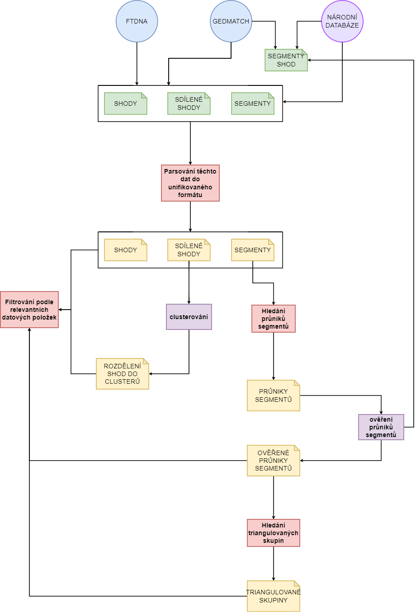

# genetic-genealogy

## Installation
To install this application, use:

    pip install git+https://github.com/zuzana-cernohousova/genetic-genealogy.git

After installing the application *gengen* command and the following subcommands will be available:

- new-project
- delete-project
- list-projects
- current-project
- checkout
- parse-matches
- parse-segments
- parse-shared-matches
- find-intersections 

These subcommands are more closely described below.

## Diagrams

### Diagram popisující funkcionalitu aplikace
Zde najdete diagram, ve kterém jsou zachyceny současné i budoucí funkce 
této aplikace. 

Nahoře je _high level schéma_ naznačující , které funkce bude aplikace podporovat, pod ním
je _low level schéma_, které popisuje dané funkce podrobněji, zmiňuje se i o konkrétní implementaci 
a jak spolu budou dané nástroje komunikovat.

https://drive.google.com/file/d/1zltsMH-SDBmn84_Kg38oEF7a6StJ5UmY/view?usp=sharing

### _High level diagram_

## COMMANDS
### gengen create-project
The _create-project_ subcommand creates a new project of a given name on a given path.
Use the _-e/--existing_ option to create a project from an existing directory.

The Project structure and properties is closer described [below](#gengen-project).

The name must be unique, if a project of that name already exists, a new one will not be created.
Use the _list-projects_ subcommand to list all projects.

Usage:

    gengen create-project example_name example/path
    gengen create-project existing_directory_name on/existing/example/path -e

> Note that the project name will be lower-cased

### gengen delete-project
The _delete-project_ subcommand is used for deleting projects.
The project directory structure will not be deleted,
but it will not be recognised as a project.

Usage:

     gengen delete-project example_name

### gengen list-projects
Use this command to display all projects available on the system. It also displays the name of the current project.
Use the _-l/--long_ option to display paths to the projects.

Usage:
    
    gengen list-projects
    gengen list-projects -l

### gengen current-project
Use this command to display the name of the current project.
Use the _-l/--long_ option to display path to the project.

Usage:
    
    gengen current-project
    gengen current-project -l

### gengen checkout
Use this command to set current project.

Usage:
    
    gengen checkout example_name

### gengen parse-matches
Subcommand _parse-matches_ je nástrojem pro unifikaci formátu seznamu shod.
Program načte data ze vstupního souboru (první argument) a uloží je do
souboru výstupního za argumentem _-of/--output_file_ ve správném formátu.
V případě, že výstupní soubor není specifikován, data jsou vypsána na standardní výstup.

Je potřeba specifikovat počáteční formát zadáním informace
o zdrojové databázi vybráním jednoho ze dvou vzájemně se vylučujících argumentů
*--ftdna* a *--gedmatch*.

Každý záznam ze vstupního souboru je porovnán s "databází" uloženou v souboru
za cestou definovanou v konfiguračním souboru aktuálního projektu [settings.ini](settings.ini)
pod klíčem _CSV_LOCATIONS.match_database_. Zde je záznam o všech dosud přidaných osobách.
Pokud je nalezena shoda, je záznamu o osobě přiděleno stejné ID.
V opačném případě je vygenerováno nové, unikátní ID a záznam je přidán do databáze.

Pomocí přepínače _-v/--verbose_ lze zvolit, zda má být na standardní výstup vypsána hláška
o tom, zda byly identifikovány nějaké nové shody a případně které (vypsáno je id a jméno).

Použití:

    gengen parse-matches input_file_from_FTDNA_path -of output_file_path --ftdna

    gengen parse-matches input_file_from_GEDmatch_path --gedmatch

### gengen parse-shared-segments
Subcommand _parse-shared-matches_ provádí propojení
a unifikaci souborů obsahujících shody sdílené mezi POI a shodami POI.

Vstupním souborem tohoto programu je csv soubor obsahující identifikaci osoby (primary match)
a cestu k souboru obsahujícímu záznamy o shodách (secondary match),
které jsou společné mezi POI a danou osobou. Všechny soubory
na které tento soubor odkazuje musí pocházet ze stejného zdroje,
ten je specifikován přepínačem *--ftdna* nebo *--gedmatch*. 
Hlavička tohoto vstupního souboru má podobu:

    id,name,path

Alespoň jedna z hodnot _id_ a _name_ musí být v každém záznamu vyplněna.

Sjednocený přehled o shodách shod je vypsán do výstupního souboru, 
který je specifikován za přepínačem _-of/--output_file_.
Pokud výstupní soubor není specifikován, jsou data vypsána na standardní výstup.

> Kvůli vyhledávání IDs v databázi je potřeba před parsováním
> shod shod zpracovat samotné shody POI pomocí příkazu _gengen parse-matches_.
>
> Pokud není primární shoda identifikována v databázi, není její soubor zpracován.

Pomocí přepínače _-v/--verbose_ lze zvolit, zda má být na standardní výstup vypsána hláška
o tom, zda byly identifikovány všechny primární i sekundární shody a případně které nebyly.

Použití:

    gengen parse-shared-matches ids_and_paths.csv -of output_file --ftdna --verbose

    gengen parse-shared-matches ids%and_paths.csv --gedmatch

### gengen parse-segments
Subcommand _parse-segments_ zajišťuje transformaci dat o segmentech do unifikovaného formátu.

Program načte data ze vstupního souboru (první argument) a uloží je do
souboru výstupního za argumentem _-of/--output_file_ ve správném formátu.
V případě, že výstupní soubor není specifikován, data jsou vypsána na standardní výstup.

Argumentem _--ftdna_ specifikujete, že data pochází z databáze společnosti FamilyTreeDNA.
Argumetny _-gl/--gedmatch_list_csv_ nebo _-gss/--gedmatch_segment_search_ specifikujete,
že data pochází z databáze GEDmatch a konkrétnění argument _-gl_ znamená,
že data pochází z Tier 1 nástroje Matched Segment List pod záložkou
Visualization Options/List/CSV, a _-gss_, že data pochází z Tier 1 nástroje Segment Search
pod záložkami Visualization Options/Chromosomes & Segments.

Pokud je zdrojem FamilyTreeDNA, je jméno každé osoby, se kterou POI sdílí segment, vyhledáno 
v "databázi" za cestou definovanou v konfiguračním souboru aktuálního projektu [settings.ini](settings.ini)
pod klíčem _CSV_LOCATIONS.match_database_ .
Pokud podle jména není nalezena žádná osoba, záznam o segmentu je přeskočen.
V opačném případě je do výsledného záznamu přidáno ID dané osoby pro snadnější následnou práci.

Přepínačem _-v/--verbose_ lze opět zvolit vypsání hlášky na standardní výstup.
Pokud není nějaké jméno specifikující identitu shody identifikováno v databázi shod, 
je v této hlášce vypsáno.

Každý záznam ze vstupního souboru je porovnán s "databází" uloženou v souboru
za cestou definovanou v konfiguračním souboru aktuálního projektu [settings.ini](settings.ini)
pod klíčem _CSV_LOCATIONS.segment_database_. Zde je záznam o všech dosud přidaných segmentech.
Pokud je nalezena shoda, je záznamu o segmentu přiděleno stejné ID.
V opačném případě je vygenerováno nové, unikátní ID a záznam je přidán do databáze.

Použití:

    gengen parse-segments input_file_from_FTDNA -of output_file --ftdna -v

    gengen parse-segments input_file_from_GEDmatch_segment_searched -gss

    gengen parse-segments input_file_from_GEDmatch_listcsv -gl

### gengen find-intersections
Subcommand _find-intersections_ umožňuje najít průniky segmentů.
Parametrem *--source_file* je možné specifikovat vstupní soubor obsahující data o segmentech v unifikovaném formátu.
Pokud parametr není zadán, je použita databáze segmentů.
Parametrem *--output_file* je možné zadat výstupní soubor, pokud tak není učiněno,
výsledek je vypsán na standardní výstup.

Jedním z následujících 2 parametrů je definována funkcionalita programu,
je možné zadat jen jeden.
Při použítí parametru *-sid/--segment_id* a zadání hodnoty id požadovaného
segmentu jsou nalezeny všechny průniky s daným zadaným segmentem.
Při použitá parametru *-id/--person_id* a zadání hodnoty id osoby jsou nalezeny všechny
průniky se všemi segmenty, která POI sdílí se zadanou osobou.
Pokud není zadán ani jeden z předchozích parametrů, jsou identifikovány všechny
průniky mezi segmenty nacházejícími se ve vstupním souboru.

Použití:

    gengen find-intersections --source_file parsed_segments_file --output_file all_intersections 

    gengen find-intersections --output_file intersections_of_person_123 -id 123

    gengen find-intersections --output_file intersections_of_segment_2431 -sid 2431

## Formáty souborů
Formáty jednotlivých druhů vstupních i výstupních souborů jsou specifikovány
pomocí tříd obsažených v souboru *headers.py*.
Výstupní soubory jsou popsány jako enum možných sloupců.

Každá z těchto tříd definuje, jak bude vypadat hlavička příslušného druhu souboru.
Je-li to potřeba, třída definuje mapování mezi sloupci vstupního a výstupního souboru.

## GENGEN PROJECT
When creating a new project a directory structure like this will be created:
    
    example/path/
    ├── settings.ini
    ├── input_files
    └── work_files

The settings.ini file contains basic information about
the project and some files location configuration. For example:
    
    [PROJECT_INFO]
    main_path = example/path
    name = example_name
    
    [CSV_LOCATIONS]
    match_database = work_files/all_matches.csv
    segment_database = work_files/all_segments.csv
