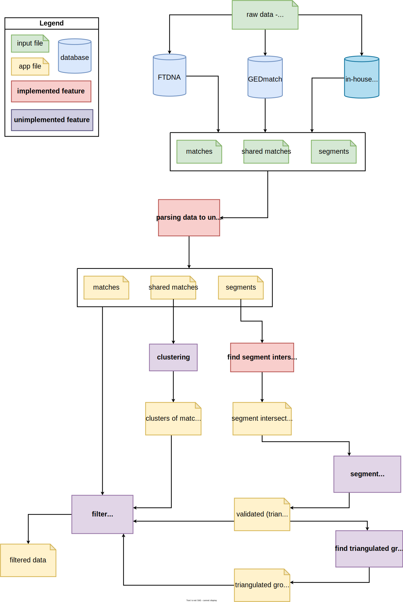

# genetic-genealogy

## Requirements

- appdirs    

## Installation
To install this application, use:

    pip install git+https://github.com/zuzana-cernohousova/genetic-genealogy.git

### Without installation
If you do not want to install this app, use this to clone the repository:

    git clone https://github.com/zuzana-cernohousova/genetic-genealogy.git

Then install requirements:

    pip install appdirs

After that, instead of this

    gengen

use this as the entry point:

    python3 genetic-genealogy/src/genetic_genealogy/gengen.py

Append any of the subcommands specified below.

## Functionality
After installing the application _gengen_ command and the following subcommands will be available:

- new-project
- delete-project
- list-projects
- current-project
- checkout
- parse-matches
- parse-segments
- parse-shared
- find-intersections 

These subcommands are more closely described [below](#commands).

## Diagrams

### A Diagram describing the functionalities of this project
Behind this link, you can find a diagram in witch there are described current
and future features of this project.
On top, there is a high level scheme of the application,
below more detail are described.

https://drive.google.com/file/d/1zltsMH-SDBmn84_Kg38oEF7a6StJ5UmY/view?usp=sharing

### _High level scheme_

## COMMANDS
### gengen new-project
The _new-project_ subcommand creates a new project of a given name on a given path.
Use the _-e/--existing_ option to create a project from an existing directory.
Each project corresponds to a distinct _person of interest (POI)_.

The Project structure and properties is closer described [below](#gengen-project).

The name must be unique, if a project of that name already exists, a new one will not be created.
Use the _list-projects_ subcommand to list all projects.

Usage:

    gengen new-project example_name example/path
    gengen new-project existing_directory_name on/existing/example/path -e

> Note that the project name will be lower-cased

### gengen delete-project
The _delete-project_ subcommand is used for deleting projects.
The project directory structure will not be deleted,
but it will not be recognised as a project.

Usage:

     gengen delete-project example_name

### gengen list-projects
Use this command to display all projects available on the system.
It also displays the name of the current project.
Use the _-l/--long_ option to display paths to the projects.

A list of all the projects is kept in a platform-specific location
defined by the appdirs package, in a file named _projects.ini_.

Usage:
    
    gengen list-projects
    gengen list-projects -l

### gengen current-project
Use this command to display the name of the current project.
Use the _-l/--long_ option to display path to the project.

Usage:
    
    gengen current-project
    gengen current-project -l

### gengen checkout
Use this command to set current project.

Usage:
    
    gengen checkout example_name

### gengen parse-matches
The _parse-matches_ subcommand is a tool for matches information format unification.
This program loads input data from source file specified by the _-sf/--source_file_ argument
and saves it into the output file (_-of/--output_tile_) in the correct, unified format.
If no source file is given, data is loaded from standard input,
if no output file is given, data si written to standard output.

Source file format must be specified by one of the mutually exclusive arguments
_--ftdna_ or _--gedmatch_.

Every record from the source file is compared with a database known matches of POI.
If the newly read record is of a known match, the same ID is given to the match,
else a new unique ID is generated and the record is added to the database.

Use the _-v/--verbose_ argument to display a message about the program run,
specifically if new matches have been identified.

Usage:

    gengen parse-matches -sf input_file_from_FTDNA_path -of output_file_path --ftdna

    gengen parse-matches --gedmatch

### gengen parse-shared
The _parse-shared_ subcommand parses shared matches information to a unified format.
Input file of this feature is a configuration file describing where to find matches 
shared with witch person.

The configuration file is of this format:

    person_id,path

In the _path_ column, there is a path to a file containing shared matches between POI
and person specified by the _person_id_ column.
If the _person_id_ is not found in matches database, the corresponding file is skipped.

Each file must come from the same source database,
the source database is specified by the _--ftdna_ or _--gedmatch_ argument.

The input file path is either specified by the _-cf/--config_file_ argument,
or when the argument is not given, input is read from standard input.

A combined list of all the shared matches in a unified format is written to
the output file if it is given by the _-of/--output_file_ argument.
Else it is written to standard output.

Use the _-v/--verbose_ argument to display a message about the program run,
specifically if all files were parsed.

Usage:

    gengen parse-shared -of output_file --ftdna --verbose

    gengen parse-shared -cf ids_and_paths.csv --gedmatch

### gengen parse-segments
Similar to the _parse-matches_ subcommand is the _parse-segments_ subcommand.
This program loads input data from source file specified by the _-sf/--source_file_ argument
and saves it into the output file (_-of/--output_tile_) in the correct, unified format.
If no source file is given, data is loaded from standard input,
if no output file is given, data si written to standard output.

Source file format must be specified by one of the mutually exclusive arguments
_--ftdna_, _-gss/--gedmatch_segment_search_ or _-gl/--gedmatch_list_csv_.
On GEDmatch Tier 1 you can get segment data from the One-to-many tool,
the argument _-gss_ corresponds to using _Visualization Options/Chromosomes & Segments_,
the argument _-gl_ on the other hand _Visualization Options/List/CSV_.

Every record from the source file is compared with a database known segments.
If the newly read record is of a known segment, the same ID is given to the segment,
else a new unique ID is generated and the segment record is added to the database.

Use the _-v/--verbose_ argument to display a message about the program run,
specifically if new segments have been identified.

Usage:

    gengen parse-segments -sf input_file_from_FTDNA -of output_file --ftdna -v

    gengen parse-segments -sf input_file_from_GEDmatch_segment_searched -gss

    gengen parse-segments -gl -v

### gengen find-intersections
The _find-intersections_ subcommands is used to find intersections
of a selection of segments or all segments.

Input file containing a list of segments can be given by
the _-sf/--source_file_ argument, or the list will be read from standard input.
Alternatively use the _-fd/--from_database_ argument
to use the whole segment database as the source file.

Segment intersections will be written to the output file specified by the
_-of/--output_file_ argument, or will be written to the standard output.

If no other arguments are given, intersection of all segments present in the segments list 
will be found. Use the _-sid/--segment_id_ argument to find intersections only 
with a segment specified by its ID.
Use the _-pid/--person_id_ argument to find intersections of segments shared with
a person specified by their ID.

Usage:

    gengen find-intersections --source_file parsed_segments_file --output_file all_intersections 

    gengen find-intersections -of intersections_of_person_123 -pid 123

    gengen find-intersections -fd --output_file intersections_of_segment_2431 -sid 2431

## File formats
CSV formats of all kinds of source and output files are specified
by corresponding enums in the [formats.py](src/genetic_genealogy/parsers/formats.py) file.

## GENGEN PROJECT
When creating a new project a directory structure like this will be created:
    
    example/path/
    ├── settings.ini
    ├── input_data/
    └── database/

The settings.ini file contains basic information about
the project and some files location configuration. For example:
    
    [PROJECT_INFO]
    main_path = example/path
    name = example_name
    
    [CSV_LOCATIONS]
    match_database = database/all_matches.csv
    segment_database = database/all_segments.csv
    command_log = database/command_log.csv

The command_log location is used for saving all the relevant commands (parsing and intersections subcommands)
as well as the working directories so that the whole pipeline can be replicated. 

## Example
In the [anonym_example](anonym_example) directory, anonymized input files can be found.
Use the following commands to try them out while working from the root of this repository.

    # create a new project while creating a new directory - example-dir
    gengen new-project example example-dir

    # show existing projects
    gengen list-projects

    # make the example project the current one
    gengen checkout example

    # see if the current project was set proprerly
    gengen current-project

    # parse matches from FamilyTreeDNA
    # use -v/--verbose to print information about new matches added to the database 
    gengen parse-matches --ftdna -sf anonym_example/FTDNA/FTDNA_match_data.csv -of example-dir/FTDNA_matches.csv -v
    
    # parse matches from GEDmatch
    gengen parse-matches --gedmatch -sf anonym_example/GEDmatch/GEDmatch_match_data.csv -of example-dir/GEDmatch_matches.csv

    # parse segments from FamilyTreeDNA
    # use -v/--verbose to print information if new segments beeing added to the database and if any names were not identified
    gengen parse-segments --ftdna -sf anonym_example/FTDNA/FTDNA_segment_data.csv -of example-dir/FTDNA_segments.csv -v
    
    # try again the same command and see that no new segments are added to the database
    gengen parse-segments --ftdna -sf anonym_example/FTDNA/FTDNA_segment_data.csv -of example-dir/FTDNA_segments.csv -v

    # parse segments from FamilyTreeDNA
    gengen parse-segments -gss -sf anonym_example/GEDmatch/GEDmatch_segments_gss.csv -of example-dir/GEDmatch_segments_gss.csv
    gengen parse-segments -gl -sf anonym_example/GEDmatch/GEDmatch_segments_gl.csv -of example-dir/GEDmatch_segments_gl.csv

    # find intersections between segments from a file
    gengen find-intersections -sf example-dir/FTDNA_segments.csv -of example-dir/FTDNA_segments_intersections.csv

    # find intersections of all segments currently in the database
    gengen find-intersections -fd -of example-dir/all_segments_intersections.csv

    # find intersections of segments from one preson
    gengen find-intersections -fd -pid 1 -of example-dir/person_1_segments_intersections.csv
    
    # find intersections of one segment
    gengen find-intersections -fd -sid 1 -of example-dir/segment_1_segments_intersections.csv

     
